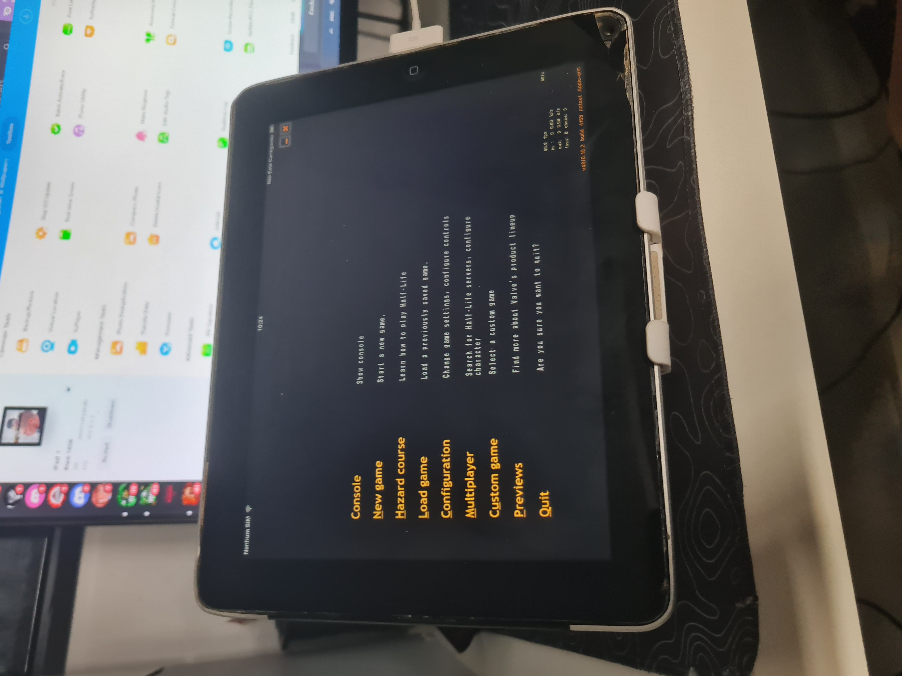

# Xash3D iOS 5 – iPad 1

A port of Xash3D adapted to run Half-Life on the original iPad 1
(iPad1,1) running iOS 5.1.1.

## Status

Tested on:

- iPad 1 / iPad1,1
- Apple A4
- PowerVR SGX 535
- 256 MB RAM
- iOS 5.1.1
- ARMv7

Working:

- ✅ Half-Life singleplayer
- ✅ Hazard Course
- ✅ OpenGL ES 1.1 rendering
- ✅ Touch controls
- ✅ Audio
- ✅ Menus
- ✅ Map transitions
- ✅ iOS 5.1.1
- ✅ ARMv7

Performance in tested areas is approximately 50–60 FPS.

## Screenshots

  
  

  
  

  
  

> Running on a real original iPad 1 (iPad1,1) with iOS 5.1.1.

## Main changes

This port includes several changes required for the original iPad:

- iOS deployment target lowered to 5.1
- ARMv7-only build
- SDL 2.0.3 for compatibility with older iOS SDKs
- iOS 5 launcher compatibility fixes
- SDL/UIKit window initialization fixes
- OpenGL ES compatibility shim
- NanoGL fix for loading Apple's OpenGLES.framework
- OpenGL ES multitexture compatibility
- Old Xash3D compatibility fixes for modern Clang
- Low-memory rendering optimizations for the iPad 1
- Build scripts for a cctools-based Linux/WSL toolchain

## Building

The included scripts build the port using an iOS cross-compilation
toolchain on Linux/WSL.

Main scripts:

- `build-sdl-ios5.sh`
- `build-nanogl-ios5.sh`
- `build-engine-ios5.sh`
- `build-objc-ios5.sh`
- `link-ios5.sh`

The target is:

- Architecture: ARMv7
- Minimum iOS: 5.1
- Device family: iPad / iPhone compatible application

An iPhoneOS SDK and compatible cctools toolchain are required.

Apple SDK files are NOT included in this repository.

## Half-Life game files

Half-Life game data is NOT included.

You must own Half-Life and copy your own `valve` directory to the
application's Documents directory.

Because the iPad 1 only has 256 MB of RAM, reduced-resolution WAD
textures may improve stability.

Do not distribute Valve game assets with this repository.

## Credits

- Xash3D / Xash3D FWGS developers
- mittorn – original Xash3D iOS port
- SDL developers
- NanoGL developers
- Valve – Half-Life
- iOS 5 / iPad 1 porting and hardware testing: AdroitLeopard6
- Debugging and build assistance: ChatGPT (OpenAI)

## Disclaimer

This is an unofficial community port intended for preservation and
experimentation on legacy hardware.

Half-Life and related assets are property of Valve Corporation.
